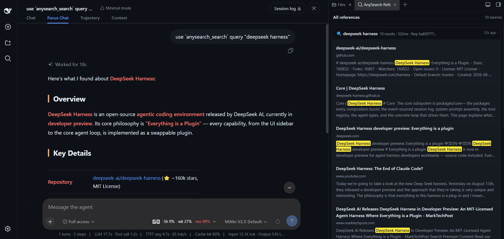

# dsh-anysearch-refs

<p align="center">
  <a href="https://github.com/deepseek-ai"></a>
  <a href="https://github.com/deepseek-ai"></a>
</p>

[English](#english) · [中文](#中文)

---

## English

A DSH sidebar plugin that shows AnySearch references as cards, with the search query, source snippets and highlighted keywords in the right sidebar.

It captures `anysearch_search` / `anysearch_batch_search` tool results and renders them in a dedicated DSH sidebar tab.




> **Status**: early iteration. If you send a PR, please rebase onto the latest `main`.

### Prerequisites

Install these separately in your DSH profile first:

| Package | Purpose |
| --- | --- |
| [`@anysearch/anysearch-dsh`](https://github.com/anysearch-team/anysearch-dsh) | AnySearch data source / tool events |
| [`dsh-better-sidebar`](https://github.com/omdsh-dev/DSH-better-sidebar) | Right sidebar / tab hosting |

### Installation

For normal users, these three commands are enough — no `pnpm` needed:

```bash
dsh plugin --profile web add @anysearch/anysearch-dsh
dsh plugin --profile web add dsh-better-sidebar
dsh plugin --profile web add dsh-anysearch-refs
```

Then restart `dsh web` and hard-refresh the browser (`Ctrl+Shift+R` / `Cmd+Shift+R`).

For local development / unpublished builds:

```bash
dsh plugin --profile web add "link:/absolute/path/to/dsh-anysearch-refs"
```

### Build from source

Developers only:

```bash
pnpm install
pnpm run build
pnpm run check
```

### Contributing

- Rebase onto the latest `main` before PR.
- Run `pnpm run check` before pushing.
- Do not modify DSH core or `dsh-better-sidebar` source.

### License

MIT

---

## 中文

一个 DSH 侧边栏插件，把 AnySearch 的搜索结果以卡片形式展示在右侧侧边栏中，包括搜索词、来源摘要和关键词高亮。

它捕获 `anysearch_search` / `anysearch_batch_search` 的工具结果，并在 DSH 侧边栏中单独展示。


> **状态**：早期迭代中。如果提交 PR，请先 rebase 到最新的 `main`。

### 前置依赖

需要先在 DSH profile 中单独安装：

| 包 | 作用 |
| --- | --- |
| [`@anysearch/anysearch-dsh`](https://github.com/anysearch-team/anysearch-dsh) | AnySearch 数据源 / 工具事件 |
| [`dsh-better-sidebar`](https://github.com/omdsh-dev/DSH-better-sidebar) | 右侧侧边栏 / tab 容器 |

### 安装

普通用户只需要这三条命令，**不需要 pnpm**：

```bash
dsh plugin --profile web add @anysearch/anysearch-dsh
dsh plugin --profile web add dsh-better-sidebar
dsh plugin --profile web add dsh-anysearch-refs
```

然后重启 `dsh web`，并在浏览器中硬刷新（`Ctrl+Shift+R` / `Cmd+Shift+R`）。

本地开发 / 未发布版本：

```bash
dsh plugin --profile web add "link:/绝对路径/dsh-anysearch-refs"
```

### 源码构建

仅开发者需要：

```bash
pnpm install
pnpm run build
pnpm run check
```

### 贡献

- 提交 PR 前请 rebase 到最新 `main`。
- 推送前运行 `pnpm run check`。
- 不要修改 DSH 核心或 `dsh-better-sidebar` 源码。

### License

MIT
